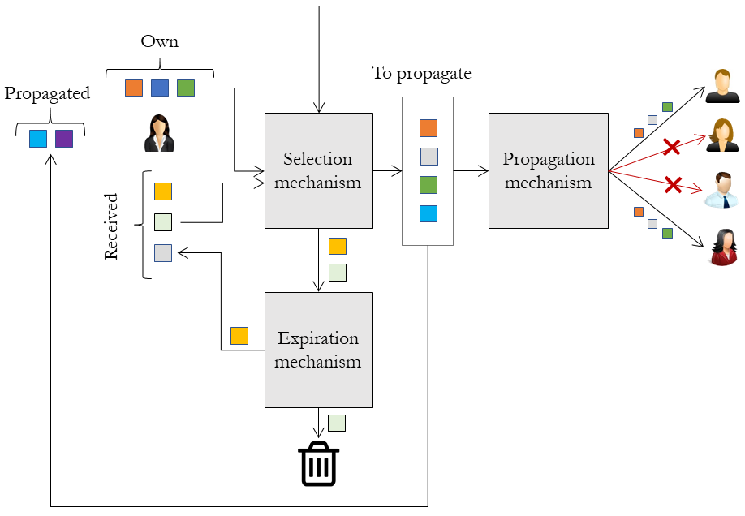
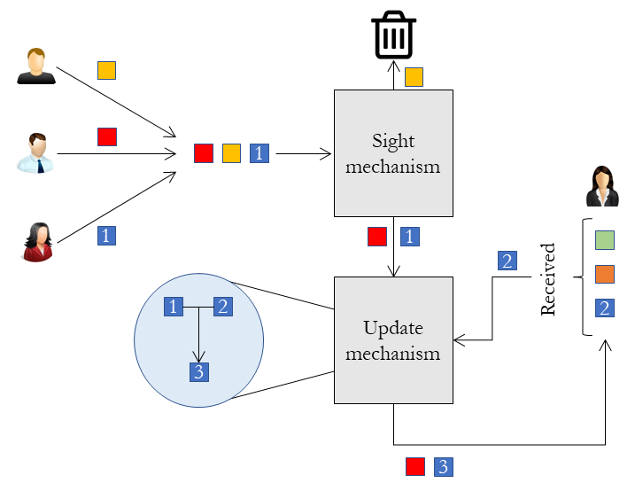

Simulation description
=======================
In order to use the information diffusion simulations, it is important to understand how they work, so they can be properly configured. Our simulations consider that time is discrete: they are divided in time steps, where information is exchanged between the users (no information is spread in the network between two consecutive iterations of the process). Then, in this section, we describe a single information diffusion step.

* `Information spread`_
* `Information reception`_

Information spread
^^^^^^^^^^^^^^^^^^^^^^
We illustrate in the following feature the process for spreading information pieces to different people in the network:

   Example of the spreading information process.

In the figure, the woman in the left represents the user who is going to propagate some information in the network. At each time step,
she has three different lists of contents she can propagate:

* **Own contents:** These are contents originally created by the user.
* **Received contents:** These contents have been received by the user (and never spread before).
* **Propagated contents:** These contents have already been propagated in past iterations.

At every point of time, the user might spread a selection of the contents included in her three lists. To determine which contents to spread, we use what we have named a **selection mechanism**. For instance, we might choose one item from each list randomly, all of them, etc. The spread contents are moved to the *propagated contents* list.

Once the elements have been selected, it is necessary to choose the users who shall receive these information pieces. This is done by a **propagation mechanism**, who chooses which users in the network might receive each of the information pieces, and propagates the information to them. We shall later explain how users manage to receive and read these user-generated contents.

But, once the user has propagated some information, we pass all the non-propagated information pieces coming from the *received* list, and we establish if we are going to be able to propagate them in future iterations. For this, we use what we call an **expiration mechanism**. This expiration mechanism determines (using some properties of the piece, like the time it has been in the received list, the author of the piece, etc.) whether the user might be able to share the 
information in the future (and, as such, it returns to the *received* list), or not (and the piece is removed from that list).

Information reception
^^^^^^^^^^^^^^^^^^^^^^
Users store all the received information in a user-generated content list, named the *received list*. We need to describe how pieces manage to reach the *received* list. We illustrate this in the following figure:

   Example of the receiving information process.

Each iteration, users receive a variable amount of information pieces (for instance, the three pieces in the figure). However, it is uncommon for the people in the network to read all the information is received. Because of this, an attention mechanism is provided, named **sight mechanism** which determines the subset
of the received contents which are actually read by the user. Any other piece is discarded, and never reaches the *received list*.

All the information pieces passing this filter are later included in the *received* list. However, it might happen that we received any of the contents in the past (as it is the case of the blue content in the figure). Some of the available meta-information of these user-generated contents might vary (for instance, we might have received it from different users). So, it is interesting to somehow combine this information in order to store it in the *received* list. This is done by what is called an **update mechanism**. The outcome of the update mechanism is then included in the *received list*.

