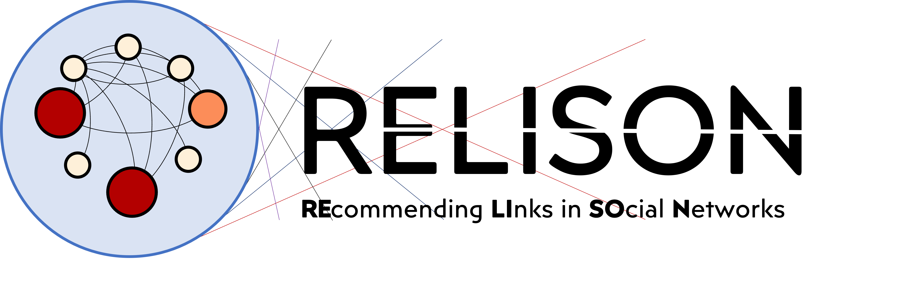

Introduction
===============

RELISON is a comprehensive framework for social network analysis and recommendation in Java. This framework
allows the analysis of multiple structural properties of a social network graph (from simple ones like the 
nodes degree or the distance between nodes to more complex ones like betweenness or random walk probabilities),
detect the communities in a social network, predict and recommend which links are more likely to appear in
the network in the future, and analyze the flow of information that travels through the network.

RELISON has an special focus on the link recommendation (also known as contact recommendation) problem in
social networks, i.e. recommending those people in a social network with whom a given user might be interested
to connect. Among its main goals, RELISON aims to provide efficient tools for executing and evaluating such
approaches, considering not only their accuracy, but also other aspects like their novelty, diversity, and the
effects such recommendations have on global properties of the networks (as changes in the structural properties
or in the speed or diversity of the information diffusion).

These framework is divided in 6 different components:

* **RELISON-core:** Basic graph definitions and generators.
* **RELISON-sna:** Social network analysis metrics and community detection.
* **RELISON-content:** Classes and definitions for user-generated contents in social networks.
* **RELISON-linkpred:** Link prediction and contact recommendation functionalities.
* **RELISON-diffusion:** Simulation of information diffusion dynamics.
* **RELISON-examples:** Examples showcasing the functionality of the library.
